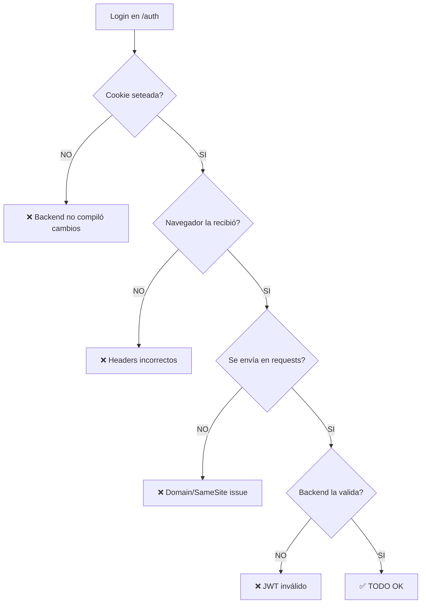

# 🚨 SOLUCIÓN AL ERROR 401 (Cookie no enviada)

## El Problema

El backend muestra:
```
➡️  GET /api/auth/me
⬅️  GET /api/auth/me - Status: 401 - Time: 0.121s
```

**Causa:** La cookie `tribi_token` no se está enviando en las peticiones subsiguientes después del login.

## Por qué sucede

1. **Login exitoso** → Cookie se setea correctamente
2. **Redirect a /admin** → **Cookie SE PIERDE** 
3. **Admin layout intenta `/api/auth/me`** → Sin cookie → 401

## Solución: REINICIAR TODO CON CACHÉ LIMPIO

### 1️⃣ Detener Todo

Presiona `Ctrl+C` en TODAS las terminales que tengan servicios corriendo:
- Backend (FastAPI)
- Frontend (Next.js)  
- Mobile (Expo)

### 2️⃣ Limpiar Caché del Backend

```powershell
cd apps\backend
# No hay caché persistente, solo reiniciar
```

### 3️⃣ Limpiar Caché del Frontend

```powershell
cd apps\web
rm -r .next
rm -r node_modules\.cache
```

### 4️⃣ Limpiar Caché del Mobile

```powershell
cd apps\mobile
rm -r .expo
rm -r node_modules\.cache
```

### 5️⃣ Limpiar Cookies del Navegador

**Chrome/Edge:**
1. Abre DevTools (F12)
2. Application tab
3. Cookies → `http://localhost:3000`
4. Elimina **TODAS** las cookies
5. **Cierra el navegador completamente**

### 6️⃣ Reiniciar Backend con Logs Activados

```powershell
cd apps\backend
python -m uvicorn app.main:app --reload --port 8000
```

**Deberías ver** los logs con emojis:
```
INFO:     Uvicorn running on http://127.0.0.1:8000
INFO:     Application startup complete.
```

### 7️⃣ Reiniciar Frontend

```powershell
cd apps\web
npm run dev
```

**Espera a que compile:**
```
✓ Ready in 3.5s
○ Local: http://localhost:3000
```

### 8️⃣ Probar Login con Logs

1. **Abre una NUEVA ventana de incógnito** en tu navegador
2. Ve a `http://localhost:3000/auth`
3. **Abre DevTools (F12)** → Console tab
4. Ingresa un email de los admin (ej: `bautiallende@hotmail.com`)
5. Click "Send Code"

**En los logs del BACKEND verás:**
```
📧 EMAIL TO: bautiallende@hotmail.com
📋 SUBJECT: Your Tribi login code
📝 BODY: Your login code is: 123456. It expires in 10 minutes.
================================================
➡️  POST /api/auth/request-code
⬅️  POST /api/auth/request-code - Status: 200 - Time: 0.050s
```

6. **Copia el código de 6 dígitos** de los logs del backend
7. Ingrésalo en el formulario
8. Click "Verify"

**En los logs del BACKEND verás:**
```
🔐 Verify code called:
  Email: bautiallende@hotmail.com
  Code: 123456
  ✅ Code verified
  🔑 JWT created: eyJhbGciOiJIUzI1NiI...
  🍪 Setting cookie:
     key: tribi_token
     httponly: True
     secure: False
     samesite: lax
     max_age: 3600 seconds
     domain: localhost
  ✅ Cookie set successfully

➡️  POST /api/auth/verify
⬅️  POST /api/auth/verify - Status: 200 - Time: 0.166s
```

**En la CONSOLA DEL NAVEGADOR verás:**
```
🔐 Verifying code for: bautiallende@hotmail.com
📥 Verify response status: 200
✅ Login successful
```

9. **Verifica que la cookie se guardó:**
   - DevTools → Application tab
   - Cookies → `http://localhost:3000`
   - Deberías ver: `tribi_token` con un valor largo

10. **Ahora intenta ir a `/admin`:**

**En los logs del BACKEND deberías ver:**
```
🔐 get_current_user called:
  Cookie (tribi_token): ✅ Present
  Using cookie token: eyJhbGciOiJIUzI1NiI...
  ✅ Token decoded successfully
  Email from token: bautiallende@hotmail.com
  ✅ User authenticated: bautiallende@hotmail.com

➡️  GET /api/auth/me
⬅️  GET /api/auth/me - Status: 200 - Time: 0.008s

🔍 Admin check:
  User email: bautiallende@hotmail.com (lowercase: bautiallende@hotmail.com)
  Admin emails from config: ['admin@tribi.com', 'test@example.com', 'bautiallende@hotmail.com', 'tribiesim@gmail.com']
  ADMIN_EMAILS env var: admin@tribi.com,test@example.com,bautiallende@hotmail.com,tribiesim@gmail.com
  Is admin: True

➡️  GET /admin/countries?page=1&page_size=1
⬅️  GET /admin/countries?page=1&page_size=1 - Status: 200 - Time: 0.012s
```

**En la CONSOLA DEL NAVEGADOR:**
```
🔐 Admin layout: Checking authentication...
📥 Admin auth response: 200
✅ User authenticated: bautiallende@hotmail.com
🔍 Checking admin privileges...
📥 Admin check response: 200
✅ Admin access confirmed
```

## 🐛 Si Sigue Dando 401

### Verificación 1: ¿Se está seteando la cookie?

**Busca en los logs del backend después del verify:**
```
🍪 Setting cookie:
     key: tribi_token
     ...
```

Si NO ves esto → El backend no está compilando los cambios nuevos.

**Solución:**
```powershell
# Detén el backend (Ctrl+C)
cd apps\backend
# Verifica que tienes los últimos cambios
git pull
# Reinicia
python -m uvicorn app.main:app --reload --port 8000
```

### Verificación 2: ¿El navegador está recibiendo la cookie?

**Después del POST /api/auth/verify**, en DevTools:
1. Network tab
2. Busca la petición `verify`
3. Click en ella
4. Headers → Response Headers
5. Busca: `Set-Cookie: tribi_token=...`

Si NO está ahí → Problema en el backend.

### Verificación 3: ¿La cookie se está enviando?

**En la petición GET /api/auth/me**, en DevTools:
1. Network tab
2. Click en la petición `me`
3. Headers → Request Headers
4. Busca: `Cookie: tribi_token=...`

Si NO está ahí → El navegador no está enviando la cookie.

**Posibles causas:**
- Domain mismatch (debería ser `localhost` en ambos)
- SameSite issue
- Navegador bloqueando cookies de terceros

### Verificación 4: ¿El COOKIE_DOMAIN está correcto?

```powershell
cd apps\backend
type .env | findstr COOKIE_DOMAIN
```

**Debe mostrar:**
```
COOKIE_DOMAIN=localhost
```

Si está vacío o diferente:
```powershell
# Edita el .env y agrega:
COOKIE_DOMAIN=localhost
```

Luego **REINICIA el backend**.

## 🔄 Flujo Completo de Debugging



## 📱 Mobile App OTA Error

Para el error de mobile:

```powershell
cd apps\mobile
# Limpiar caché completamente
rm -r .expo
rm -r node_modules\.cache

# Reinstalar dependencias
npm install

# Iniciar con caché limpio
npx expo start --clear
```

Si **sigue dando error**, el problema está en el build nativo. Necesitarías:
```powershell
# Opción 1: Reset completo de Expo
npx expo start --clear --reset-cache

# Opción 2: Reinstalar Expo Go en el dispositivo/emulador
```

El error de OTA es porque Expo está intentando buscar actualizaciones en un servidor que no existe. La configuración ya está correcta (`updates: { enabled: false }`), pero el runtime de Expo Go puede tener caché.

## ✅ Checklist Final

Después de reiniciar todo:

- [ ] Backend corriendo en puerto 8000
- [ ] Frontend corriendo en puerto 3000  
- [ ] Navegador en modo incógnito (sin cookies viejas)
- [ ] DevTools abierto (para ver logs)
- [ ] Login con email admin
- [ ] Código OTP copiado de logs del backend
- [ ] Verificación exitosa (ver logs con 🍪)
- [ ] Cookie visible en Application → Cookies
- [ ] Redirect a /admin
- [ ] Logs muestran cookie enviada (Cookie: tribi_token=...)
- [ ] Admin dashboard carga sin 401
- [ ] Console muestra "✅ Admin access confirmed"

## 🆘 Si Todo Falla

Ejecuta el script de diagnóstico:
```powershell
python diagnose.py
```

Y luego el script de pruebas:
```powershell
python test_api_complete.py
```

Y envíame:
1. Los logs del backend (desde el verify hasta el /auth/me)
2. Los logs de la consola del navegador
3. Screenshot de Application → Cookies
4. Screenshot de Network → Headers de la request /auth/me
