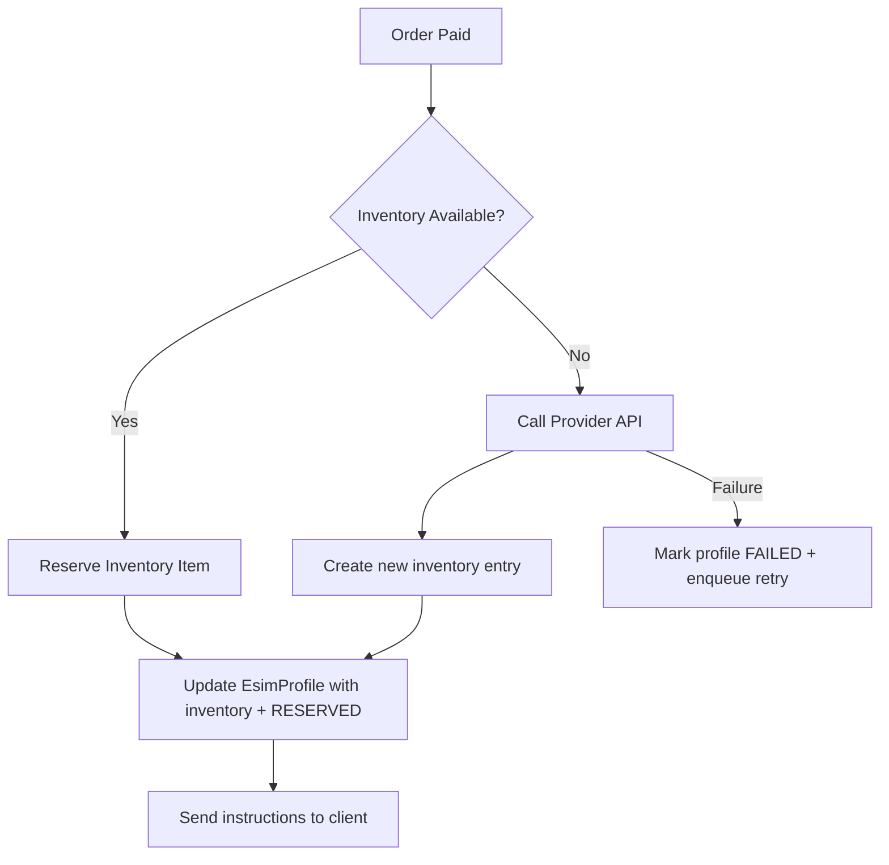

# eSIM Provisioning & Inventory Automation

_Last updated: 2025-11-20_

This document captures the plan for Phase 2 of the automation roadmap: turning `/api/esims/activate` into a real provisioning workflow backed either by inventory we already control or by a carrier/provider API. It will evolve as we build, and once implementation lands this file becomes the authoritative runbook.

## 1. Current State Snapshot

| Area            | Status                                                                                                                                                                                                          |
| --------------- | --------------------------------------------------------------------------------------------------------------------------------------------------------------------------------------------------------------- |
| Data Model      | `EsimProfile` now stores `activation_code`, `qr_payload`, `iccid`, `instructions`, and links to `esim_inventory` via `inventory_item_id`. `EsimInventory` tracks stock with status + metadata.                  |
| Activation Flow | `POST /api/esims/activate` first checks for existing provisioned data, then reserves inventory (`reserve_inventory_item`) or calls the configured provider before persisting via `_apply_provisioning_to_esim`. |
| Inventory       | Dedicated `esim_inventory` table with statuses (`AVAILABLE`, `RESERVED`, `ASSIGNED`, `RETIRED`). Reservation uses `SELECT … FOR UPDATE SKIP LOCKED` so concurrent requests do not double assign.                |
| Admin Tooling   | `/admin` panel still pending; ops visibility is via SQL/logs until dashboard work lands.                                                                                                                        |
| Tests           | `apps/backend/tests/test_esim_activation.py` now asserts idempotency, inventory reservation, provider-backed creation, and provider failure handling.                                                           |

## 2. Target Capabilities

1. **Real provisioning source**
   - Option A: Managed inventory table populated manually (CSV import) or via provider cron job.
   - Option B: On-demand API integration (ConnectedYou API) per order.
   - **Decision:** ConnectedYou will be the primary provider. We already merged a dry-run connector so switching from the local generator requires only credentials + toggling `ESIM_PROVIDER=CONNECTED_YOU`.
2. **Idempotent activation**
   - `/api/esims/activate` must detect repeated calls (e.g., webhook retries) and return the same profile once provisioned.
   - Store provider request/response payloads for traceability.
3. **Status lifecycle**
   - `PENDING_ACTIVATION` → `ASSIGNED` (reserved stock) → `ACTIVATED` (customer received).
   - Capture failure states (`PROVISIONING_FAILED`, `EXHAUSTED`).
4. **Observability + Admin hooks**
   - Emit audit events (activation start/success/failure).
   - Later phases will surface this in the admin dashboard and notifications.

## 2.5 Implementation Snapshot (2025-11-20)

- `app/api/orders.py` now owns the full activation pipeline: inventory reservation, provider fallback, and idempotent responses.
- `app/services/esim_inventory.py` encapsulates `reserve_inventory_item`, `result_from_inventory_item`, and `create_inventory_from_provisioning` helpers used by the endpoint.
- Provider abstraction lives in `app/services/esim_providers.py` with `LocalEsimProvider` (default) and `ConnectedYouProvider` (dry-run ready). Toggle via `ESIM_PROVIDER`.
- Schema + enums (`EsimInventory`, `EsimInventoryStatus`, extended `EsimStatus`) landed along with Alembic migrations referenced in `alembic/versions/*esim_inventory*.py`.
- Regression coverage: `test_esim_activation_idempotent_returns_existing_data`, `test_esim_activation_consumes_inventory_first`, `test_esim_activation_creates_inventory_when_provider_used`, and the new provider-failure test give us guardrails for Phase 2 behaviors.

## 3. Data Model Changes

| Entity                           | Proposed Fields                                                                                                                                                                                                 |
| -------------------------------- | --------------------------------------------------------------------------------------------------------------------------------------------------------------------------------------------------------------- |
| `esim_profiles`                  | ✅ `provider_reference`, `provisioned_at`, `provider_payload` now in place. Next: `inventory_item_id`, `failure_reason`, status enum update.                                                                    |
| `esim_inventory` (new)           | Tracks physical/virtual codes with `id`, `carrier_id`, `plan_id`, `activation_code`, `qr_payload`, `iccid`, `status` (`AVAILABLE`, `RESERVED`, `ASSIGNED`, `RETIRED`). Includes `metadata` JSON and timestamps. |
| `esim_provisioning_events` (new) | Append-only log of provisioning attempts (order_id, status, payload, error). Optional but useful for debugging.                                                                                                 |

### Migration Outline

1. Add new enums to `app/models/enums.py` (if present) or extend `EsimStatus` to include `RESERVED`, `ASSIGNED`, `FAILED`.
2. Create Alembic migration for `esim_inventory` table and new columns on `esim_profiles`.
3. Backfill existing profiles: mark them as `ACTIVATED` with null inventory reference until real data exists.

## 4. Backend Flow (Live Implementation)



### `/api/esims/activate`

1. Validate ownership + `Order.status == paid` before proceeding.
2. Short-circuit if the profile already has `provisioned_at` or `status in {ASSIGNED, ACTIVE}` and return the serialized record idempotently.
3. Assemble targeting metadata (`plan_id`, `country_id`, `carrier_id`) from the profile or plan snapshot.
4. Call `reserve_inventory_item` which issues a `SELECT … FOR UPDATE SKIP LOCKED` query to fetch the next AVAILABLE record matching those filters. If found, convert it into an `EsimProvisioningResult` via `result_from_inventory_item`.
5. If no stock is available, delegate to `get_esim_provider()` (defaults to Local, can be ConnectedYou). Successful provider responses are persisted through `create_inventory_from_provisioning` so we retain traceability even for on-demand codes.
6. `_apply_provisioning_to_esim` finalizes the `EsimProfile`, updates/assigns the inventory row, and stamps timestamps + metadata.
7. Any `EsimProvisioningError` bubbles up as HTTP 502 with a friendly message and the DB transaction rolls back, leaving the profile in `pending_activation`.

### Provider Abstraction

Create `app/services/esim_providers.py` with:

```python
class EsimProvisioningError(Exception): ...

class EsimProvider(Protocol):
    def provision(self, order: Order, plan: Plan) -> EsimProvisionResult: ...
```

`EsimProvisionResult` should capture `activation_code`, `qr_payload`, `iccid`, `instructions`, `expires_at` etc. ✅ `app/services/esim_providers.py` now exposes:

- `LocalEsimProvider` (current default) – reproduces legacy behavior but routes through the abstraction.
- `ConnectedYouProvider` – fully parameterised client with dry-run mode (default) so we can log payloads and store provider metadata immediately. Switching to live traffic requires secrets + `CONNECTED_YOU_DRY_RUN=false`.

Environment variables:

| Variable                                             | Purpose                                                                          |
| ---------------------------------------------------- | -------------------------------------------------------------------------------- |
| `ESIM_PROVIDER`                                      | `LOCAL` (default) or `CONNECTED_YOU`.                                            |
| `CONNECTED_YOU_BASE_URL`                             | Sandbox or production endpoint.                                                  |
| `CONNECTED_YOU_API_KEY` / `CONNECTED_YOU_PARTNER_ID` | Credentials provided by ConnectedYou.                                            |
| `CONNECTED_YOU_TIMEOUT_SECONDS`                      | HTTP timeout (seconds).                                                          |
| `CONNECTED_YOU_DRY_RUN`                              | When `true`, skips the HTTP call and returns deterministic fake payloads for QA. |

## 5. Testing Strategy

| Layer       | Tests                                                                                                                                                                                     |
| ----------- | ----------------------------------------------------------------------------------------------------------------------------------------------------------------------------------------- |
| Unit        | Inventory helpers (`reserve_inventory_item`, `result_from_inventory_item`) covered indirectly by integration tests; add concurrency fuzzing later.                                        |
| Integration | `POST /api/esims/activate` now covered by pytest cases for idempotency, inventory reservation, provider-backed creation, and provider failure handling (`tests/test_esim_activation.py`). |
| End-to-end  | Combine Stripe checkout + activation via smoke test script (manual steps documented below).                                                                                               |

### Regression Commands

```bash
pytest apps/backend/tests/test_esim_activation.py
pytest apps/backend/tests/test_orders_flow.py -k activate
```

Key assertions:

- Inventory-first activation links the original stock row and flips it to `ASSIGNED`.
- Provider-driven activation creates a synthetic inventory record tied to the new profile.
- Provider failures return HTTP 502 and keep the profile in `pending_activation`.

Mock provider responses with deterministic fixtures. For concurrency, use SQLAlchemy session-level tests verifying `SKIP LOCKED` behavior (or simulate via two transactions in pytest).

## 6. Operational Checklist & Runbook

- [x] Decide primary carrier/provider for MVP (ConnectedYou dry-run scaffolding merged) and plan stock import script (`scripts/setup-esim-inventory.py`).
- [ ] Rotate secrets/API keys for provider integrations and document in `docs/SECRETS.md` (future).
- [ ] Update `docs/manual_smoke_tests.md` to include provisioning validation steps.
- [ ] Ensure monitoring hooks exist (structured logs: `esim_provisioning=success|failure`).

### Runbook: Inventory-first Activation

1. **Seed inventory**

   ```sql
   INSERT INTO esim_inventory (plan_id, carrier_id, country_id, activation_code, iccid, qr_payload, instructions)
   VALUES (123, NULL, NULL, 'INV-ABC123', '89010000000000000123', 'LPA:1$INV-ABC123', 'Install via device settings');
   ```

   Rows default to `AVAILABLE`. CSV/script imports should set `status` explicitly when migrating historical stock.

2. **Trigger activation** via API or Postman:

   ```bash
   curl -H "Authorization: Bearer <token>" -d '{"order_id":42}' http://localhost:8000/api/esims/activate
   ```

3. **Verify assignment**
   - `SELECT * FROM esim_inventory WHERE id = <inventory_id>;` should show `status = ASSIGNED` and `assigned_at` populated.
   - `EsimProfile.inventory_item_id` stores the association.

### Runbook: ConnectedYou On-demand

1. Set environment variables:
   - `ESIM_PROVIDER=CONNECTED_YOU`
   - `CONNECTED_YOU_PARTNER_ID=<provided>`
   - `CONNECTED_YOU_API_KEY=<provided>` (optional when `CONNECTED_YOU_DRY_RUN=true`).
2. Update `.env` and restart the backend (`make dev` or `uvicorn app.main:app --reload`).
3. ConnectedYou dry-run mode logs the outbound payload and returns deterministic test codes. Toggle `CONNECTED_YOU_DRY_RUN=false` only after validating credentials in staging.
4. Monitor logs for `ConnectedYou dry-run payload` entries and confirm the returned activation data is persisted.

### Manual Smoke Test

1. Run `pytest apps/backend/tests/test_payments_stripe.py` to ensure the payment happy path remains healthy.
2. Seed at least one `esim_inventory` row for the target plan.
3. Complete the auth → order → payment flow via the API client (see `docs/manual_smoke_tests.md`).
4. Call `/api/esims/activate` twice; the first response should reference the seeded inventory, the second should return the same payload (idempotency check).
5. Temporarily remove inventory and repeat activation to exercise the provider fallback (ensure the response still succeeds and a synthetic inventory row exists).
6. (Optional) Monkeypatch `get_esim_provider` to raise `EsimProvisioningError` in a REPL an confirm HTTP 502 is returned and the profile stays in `pending_activation`.

## 7. Timeline & Dependencies

1. **Week 1:** Schema + inventory CRUD scripts; implement `LocalInventoryProvider` and update `/api/esims/activate` to use it.
2. **Week 2:** Add provider abstraction, implement one real carrier adapter behind feature flag, seed test inventory.
3. **Week 3:** Regression tests, documentation (`docs/ESIM_AUTOMATION.md` final), handoff to ops (manual instructions, dashboards TBD).

## 8. Open Questions

1. When will ConnectedYou issue production credentials + initial inventory? Need sandbox confirmation and go-live checklist.
2. Do we require KYC or device checks before provisioning? (Impacts API payload.)
3. Should activation emails/SMS be triggered immediately or after the user installs the profile? (Affects notification design.)

---

This plan will be updated as decisions are made. Implementation tasks are tracked in `docs/ROADMAP_AUTOMATION.md` under Phase 2 and in the repo issue tracker.
